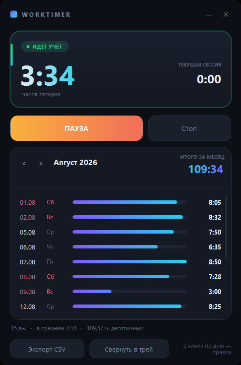

<div align="center">

# ⏱ WorkTimer

**Крошечный трекер рабочих часов, который живёт в трее Windows.**
Нажал «Старт» — считает. В конце месяца показывает итог по дням и отдаёт CSV для табеля.




</div>

---

## Зачем

Считать отработанные часы, не открывая ничего лишнего. Программа не просит установки,
не лезет в интернет и не ест ресурсы — просто иконка в трее, которая помнит, сколько ты сегодня работал.

## Возможности

|  | |
|---|---|
| ▶ **Старт / Пауза / Стоп** | из окна или прямо из меню трея |
| 🎨 **Иконка меняет цвет** | зелёная — идёт учёт, оранжевая — пауза, серая — стоп |
| 📅 **Итог по дням и за месяц** | с мини-барами, средним за день и часами в десятичном виде |
| ✏️ **Ручная правка** | двойной клик по дню: `7:30`, `7.5` или `450m` |
| 📤 **Экспорт CSV** | готовый файл для табеля |
| 🚀 **Автозапуск с Windows** | галочка в меню трея |
| 💾 **Данные не теряются** | автосохранение каждые 30 секунд |
| 🌙 **Полностью тёмный интерфейс** | безрамочное скруглённое окно, всё нарисовано вручную |

## Установка

Скачай `WorkTimer.exe` и запусти. Всё.

Никакого инсталлятора и рантайма — программа работает на .NET Framework 4,
который уже встроен в каждую Windows.

## Как пользоваться

- **Левый клик** по иконке в трее — показать или спрятать окно
- **Правый клик** — меню: Старт / Пауза / Стоп, папка с данными, автозапуск, выход
- **Наведение** — подсказка вида `Идёт учёт • сегодня 6:42`
- **Пауза** — на обед, потом «Продолжить». **Стоп** — сессия закрыта, часы за день остаются
- Крестик прячет окно в трей, а не закрывает программу
- Окно таскается за верхнюю полосу, список дней крутится колесом

## Где лежат данные

```
%APPDATA%\WorkTimer\
├─ sessions.csv    отрезки времени: начало|конец (ISO)
└─ overrides.csv   ручные правки: дата|минуты
```

Обычный текст — можно открыть, поправить, забрать с собой.
Работа через полночь корректно делится между двумя днями.

## Сборка из исходника

```cmd
build.cmd
```

Один файл `WorkTimer.cs`, компилятор `csc.exe` уже есть в Windows.
Исходник должен быть в **UTF-8 с BOM** — иначе компилятор испортит русский текст.

## Лицензия

MIT — делай что хочешь.
